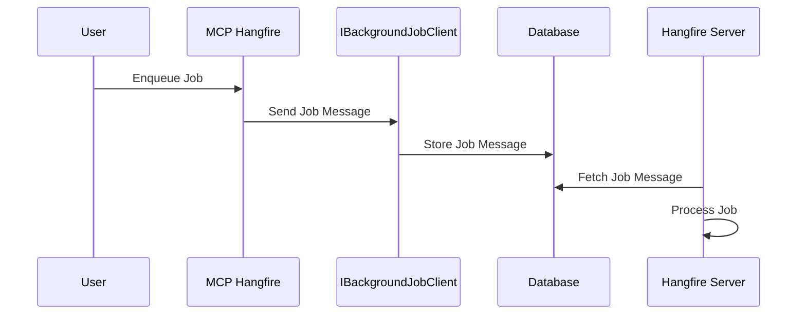

# Hangfire MCP [](https://github.com/NikiforovAll/hangfire-mcp/actions/workflows/build.yml)

Enqueue background jobs using Hangfire MCP server.

## Motivation

Interaction with *Hangfire* using *Hangfire MCP Server* allows you to enqueue jobs from any client that supports MCP protocol.
For example, you can use Hangfire MCP directly from *VS Code* in *Agent Mode* and enqueue jobs. It makes possible to execute any kind of code without writing additional code.

<video src="https://github.com/user-attachments/assets/e6abc036-b1f9-4691-a829-65292db5b5e6" controls="controls"></video>

Here is MCP Server configuration for VS Code:

```json
{
    "servers": {
        "hangfire-mcp": {
            "url": "http://localhost:3001"
        }
    }
}
```

## Code Example

Here is how it works:



### Aspire

```csharp
var builder = DistributedApplication.CreateBuilder(args);

var postgresServer = builder
    .AddPostgres("postgres-server")
    .WithDataVolume()
    .WithLifetime(ContainerLifetime.Persistent);

var postgresDatabase = postgresServer.AddDatabase("hangfire");

builder.AddProject<Projects.Web>("server")
    .WithReference(postgresDatabase)
    .WaitFor(postgresDatabase);

var mcp = builder
    .AddProject<Projects.HangfireMCP>("hangfire-mcp")
    .WithReference(postgresDatabase)
    .WaitFor(postgresDatabase);

builder
    .AddMCPInspector()
    .WithSSE(mcp)
    .WaitFor(mcp);

builder.Build().Run();
```


### MCP Server

```csharp
var builder = WebApplication.CreateBuilder(args);

builder.WithMcpServer(args).WithToolsFromAssembly();
builder.Services.AddHangfire(cfg => cfg.UsePostgreSqlStorage(options =>
    options.UseNpgsqlConnection(builder.Configuration.GetConnectionString("hangfire")))
);
builder.Services.AddHangfireMcp();
builder.Services.AddTransient<HangfireTool>();
var app = builder.Build();
app.MapMcpServer(args);
app.Run();
```

Here is an example of the Hangfire tool:

```csharp
[McpServerToolType]
public class HangfireTool(IHangfireDynamicScheduler scheduler)
{
    [McpServerTool(Name = "RunJob")]
    public string Run(
        [Required] string jobName,
        [Required] string methodName,
        Dictionary<string, object>? parameters = null
    )
    {
        var descriptor = new JobDescriptor(jobName, methodName, parameters);
        return scheduler.Enqueue(descriptor, typeof(ITimeJob).Assembly);
    }
}
```


## Tools


